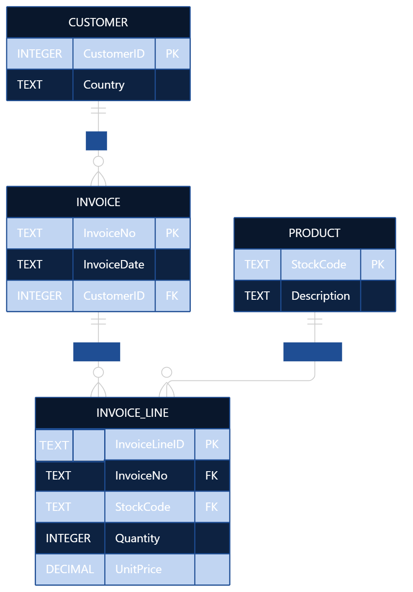

# Design Document

By Ho Khai Trung

Video overview: <https://youtu.be/0rImMfNehl8>

## Scope

This database is designed to analyze sales activities of an online retail business based on transactional sales data.
The database includes information about:
* Customers and their countries.
* Products and their descriptions.
* Invoices and invoice dates.
* Invoice line items, including product quantity and unit price.
* Product sales and cancellation/return transactions.

The database focuses on analyzing sales performance, including revenue, sales volume, customer performance, country performance, and cancellation/return activity over time.

The following areas are outside the scope of this database: product costs, profit, operating expenses, employees, suppliers, inventory management, and other business operations that are not represented in the dataset.


## Functional Requirements

The database supports the following analytical requirements:

1. Calculate total revenue from product sales across the entire dataset.
2. Analyze revenue by month to identify changes and patterns in sales performance over time.
3. Analyze sales volume by month.
4. Identify products generating the highest revenue.
5. Identify products with the highest sales volume.
6. Identify customers generating the highest revenue.
7. Analyze revenue by country.
8. Analyze sales volume by country.
9. Analyze cancellation/return quantity by month.
10. Analyze cancellation/return value by month.

For normal product sales, a transaction is considered a product sale when the quantity and unit price are both positive and the StockCode starts with a numeric character.

Cancellation/return transactions are identified by invoice numbers beginning with C and negative quantities.

## Representation

### Entities

* Customer

The Customer entity stores information about customers.

Column	    Type	Description
CustomerID	INTEGER	Unique identifier for each customer. Primary key.
Country	TEXT	Country associated with the customer.

CustomerID is the primary key of the table.

A customer's country is used to analyze sales performance across different markets.

* Product

The Product entity stores information about products sold by the retailer.

Column	    Type	Description
StockCode	TEXT	Unique identifier for a product. Primary key.
Description	TEXT	Description of the product.

StockCode is the primary key of the table.

The StockCode is also used to distinguish product records from non-product business records during sales analysis.

* Invoice

The Invoice entity stores information about customer invoices.

Column	    Type	Description
InvoiceNo	TEXT	Unique identifier for an invoice. Primary key.
InvoiceDate	TEXT	Date and time of the invoice.
CustomerID	INTEGER	Customer associated with the invoice. Foreign key and nullable.

InvoiceNo is the primary key.

CustomerID is a foreign key referencing Customer(CustomerID). It is nullable because some transactions in the original dataset do not have a CustomerID.

The invoice date is used for time-based analysis such as monthly revenue, sales volume, and cancellation/return activity.

* Invoice Line

The InvoiceLine entity stores individual line items belonging to invoices.

Column	Type	Description
InvoiceLineID	TEXT	Unique identifier for an invoice line. Primary key.
InvoiceNo	TEXT	Invoice associated with the line. Foreign key.
StockCode	TEXT	Product associated with the line. Foreign key.
Quantity	INTEGER	Number of units in the transaction.
UnitPrice	DECIMAL	Price per unit.

InvoiceLineID is the primary key.

InvoiceNo is a foreign key referencing Invoice(InvoiceNo), while StockCode is a foreign key referencing Product(StockCode).

Quantity and UnitPrice are required fields and therefore cannot be NULL.

InvoiceLineID is used as the primary key because the same combination of InvoiceNo and StockCode can occur more than once in the original dataset.

### Relationships



There are four main entities in the database: Customer, Product, Invoice, and InvoiceLine.

A Customer can have many Invoices, while each Invoice can be associated with at most one Customer.

An Invoice contains many Invoice Lines, while each Invoice Line belongs to one Invoice.

A Product can appear in many Invoice Lines, while each Invoice Line refers to one Product.

Therefore, the relationship between Invoice and Product is conceptually many-to-many, and this relationship is resolved through the InvoiceLine entity.

The relationships can be summarized as:

Customer → Invoice: 1:N
Invoice → InvoiceLine: 1:N
Product → InvoiceLine: 1:N
Invoice ↔ Product: M:N through InvoiceLine

## Optimizations

The database includes an index on InvoiceLine.StockCode:

```sql
CREATE INDEX "StockCode_search"
ON "InvoiceLine" ("StockCode");
```

This index is intended to improve query performance when searching or joining invoice lines based on StockCode.

The database also separates customers, products, invoices, and invoice lines into different tables. This avoids storing the same customer, product, and invoice information repeatedly in every transaction and provides a structured representation of the underlying data.

## Limitations

This database is designed for sales analysis and does not represent a complete retail management system.

First, the dataset does not contain product cost information. Therefore, the database can calculate revenue but cannot reliably calculate profit, gross margin, or other profitability metrics.

Second, some invoices do not have a CustomerID. As a result, analyses that require customer information, such as revenue by customer or country, cannot include transactions without an associated customer.

Third, the dataset contains only a limited period of transaction history. Therefore, monthly analysis can identify changes and potential patterns over time, but it is not sufficient to establish long-term seasonal trends across multiple years.

Finally, the database focuses on the transactional information available in the dataset. It does not include information about inventory, suppliers, employees, operating expenses, product costs, or other operational activities.
